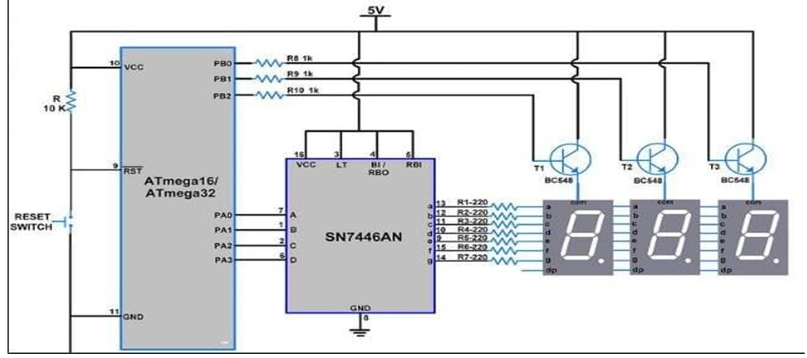

# Stopwatch System with ATmega32 and Multiplexed 7-Segment Displays

This project implements a Stopwatch system using the ATmega32 microcontroller with multiplexed 7-segment displays. It uses Timer1 in CTC mode to count time and provides the ability to start, pause, reset the stopwatch.

## Table of Contents

- [Description](#description)
- [Components](#components)
- [Circuit Diagram](#circuit-diagram)
- [How It Works](#how-it-works)
- [Getting Started](#getting-started)
- [Usage](#usage)
- [Contributing](#contributing)

## Description

This project utilizes an ATmega32 microcontroller running at 1 MHz to create a digital stopwatch with multiplexed 7-segment displays. The system is capable of measuring time in hours, minutes, and seconds and allows you to start, pause, and reset the stopwatch. It uses external interrupts to control these functions through buttons.

## Components

- ATmega32 Microcontroller
- 7-Segment Displays
- 7447 BCD to 7-Segment Decoder
- NPN BJT Transistors
- Push Buttons
- Resistors
- Capacitors

## Circuit Diagram

Here is the basic circuit diagram for the Stopwatch system:

## How It Works

The Stopwatch works by counting time using Timer1 in CTC (Clear Timer on Compare Match) mode. It is displayed on six common anode 7-segment displays using multiplexing. The system uses external interrupts to start, pause, and reset the stopwatch. The stopwatch can also handle rollover after 24 hours.

## Getting Started

1. Clone this repository to your local machine.
2. Set up the hardware according to the circuit diagram.
3. Compile the code and program your ATmega32 microcontroller.
4. Connect power to the MCU, and the Stopwatch will start counting.

## Usage

- Press the button connected to INT0 to reset the Stopwatch.
- Press the button connected to INT1 to pause the Stopwatch.
- Press the button connected to INT2 to resume the Stopwatch.

## Contributing

If you'd like to contribute to this project, please follow these steps:

1. Fork the repository.
2. Create a new branch for your feature or bug fix.
3. Make your changes and commit them.
4. Push your changes to your fork.
5. Submit a pull request to this repository.
---
